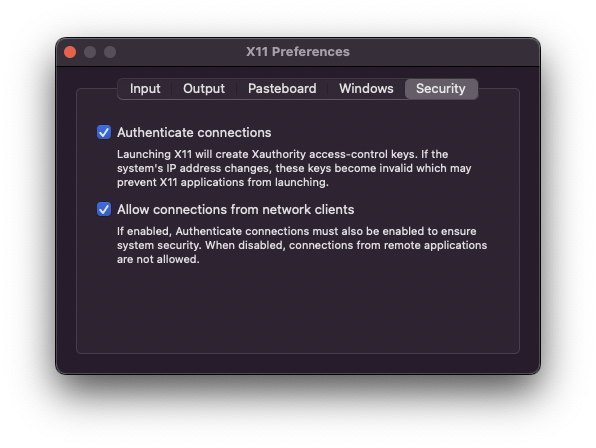

# Gaussian

## ChemCraft

**ChemCraft can run on an M1 Mac, but it will be very slow because it is will be executed via a Docker container that is running on an emulated x86_64 Linux kernel.**

This setup guide assumes you already have **XQuartz** and **Docker Desktop for Mac** installed.

1. Setup XQuartz.

Open up XQuartz Preferences (`cmd+,`), and under **Security**, check `Allow connections from network clients`.



2. Setup Docker container.

Build the Docker image.

```bash
compchem$ cd chemcraft
compchem/chemcraft$ docker build -t chemcraft .
```

3. Start `socat` on the host machine.

```
# host machine
socat TCP-LISTEN:6000,reuseaddr,fork UNIX-CLIENT:\"$DISPLAY\"
```

- source: https://archive.ph/wfMIJ

4. Start XQuartz.

5. Start the Docker container.

Get your local network IP address (typically in the form `192.168.x.y`).

```bash
docker run -it --name chemcraft -e DISPLAY=<your local ip address>:0 -v /tmp/.X11-unix:/tmp/.X11-unix chemcraft
```

This starts a container called `chemcraft` that runs the image `chemcraft` we just built, and drops us into an interactive shell (`-it`). The volume `/tmp/.X11-unix` lets us communicate with XQuartz.

6. Run the `./Chemcraft` executable within the Docker container.

